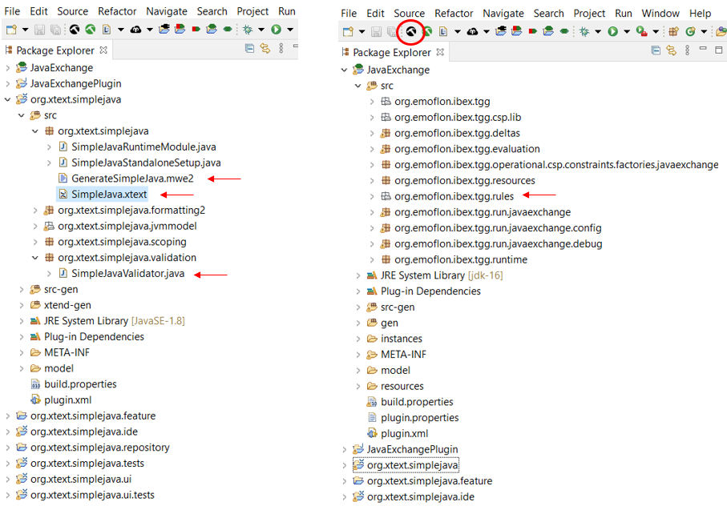
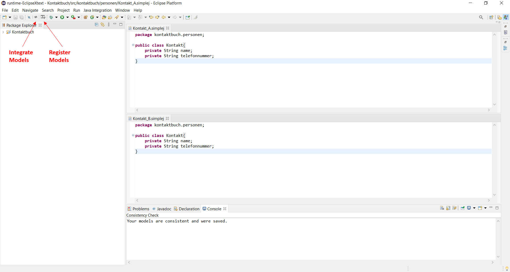

# Java-Integrator

With the Java-Integrator two simple Java files can be synchronized. The Java-Integrator propagates changes from one file to the other file and vice versa. In the process, conflicts are detected and presented to the developer who then decides how to resolve them.

## [Prerequisite]

Install [**eMoflon::IBeX**](https://github.com/eMoflon/emoflon-ibex-updatesite) as explained.

## [Configure]

1. The language grammar can be customized in SimpleJava.xtext located in org.xtext.simplejava. Once adjusted, run GenerateSimpleJava.mwe2 located in the same package.
2. In SimpleJavaValidator in org.xtext.simplejava.validation language constraints can be defined which cannot explicitly be defined in the Xtext grammar, 
	e.g. ensuring that field names are unique within a class.
3. In the JavaExchange project folder the bidirectional model transformation can be configured. The TGG rules are defined in org.emoflon.ibex.tgg.rules. 
	Once customized, build the project by selecting the black hammer button in the eMoflon perspective.
	

## [Use] 

1. Select the JavaExchangePlugin project folder and run the project as "Launch Runtime Eclipse". A new Eclipse window will open.
2. Create/open two .simplej files which should be synchronized.
3. Register both files by selecting the "Register Models" button. You should receive a message in the console confirming a successful registration.
4. After the files have been modified the modifications can be propagated by selecting the "Integrate Models" button.
5. In case of a conflict, you are requested to choose how the conflict should be resolved. After a successful integration you receive a message that the integration is completed.

